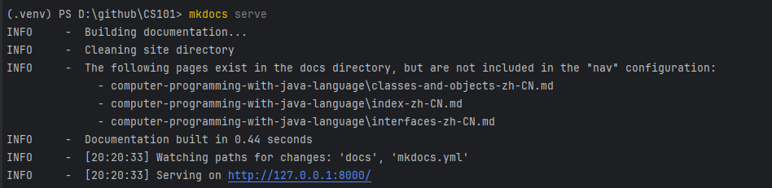

# CS101/HMU-1.101: Computer Science from Scratch

Welcome to the world of computer science! Here, you will discover a wealth of knowledge and resources to help you understand the fundamentals of computing, programming, and technology. This field is constantly evolving and plays a crucial role in various aspects of our daily lives.

## Available Languages
- [English](README.md)
- [中文](README-ZH.md)

## What You Will Learn

1. **Programming Basics**: Understand programming languages such as Python, Java, or C++.
2. **Data Structures and Algorithms**: Learn how to organize, manage, and process data.
3. **Computer Systems**: Explore how computers work, including hardware and operating systems.
4. **Web Development**: Master the skills to build websites and applications.
5. **Software Engineering**: Understand the principles of software development and project management.
6. **Artificial Intelligence and Machine Learning**: Gain insights into cutting-edge technologies that shape the future.

## Local Deployment

<details>
<summary>Click here to view Windows installation steps</summary>

1. Visit the [Python official website](https://www.python.org/downloads/).
2. Click the “Download Python” button to download the latest version of the installer.
3. Run the downloaded installer.
4. In the installation interface, make sure to check the “Add Python to PATH” option.
5. Click “Install Now” to proceed with the installation.
6. After installation, open the command prompt and enter the following command to verify the installation:
   ```cmd
   python --version
   ```
7. You may need to restart the terminal or manually update the environment variables; it is recommended to restart your operating system to ensure the settings take effect.

</details>

<details>
<summary>Install Project Dependencies</summary>

This course uses `mkdocs`, and you can install the dependencies using `pip`:
```bash
pip install -r requirements.txt
```

</details>

<details>
<summary>Run the Project</summary>

Use the following command to start the project:
```bash
mkdocs serve
```

</details>

<details>
<summary>Run Effect Diagram</summary>



If everything goes smoothly, you can access [http://127.0.0.1:8000/](http://127.0.0.1:8000/) to view this course locally.

</details>